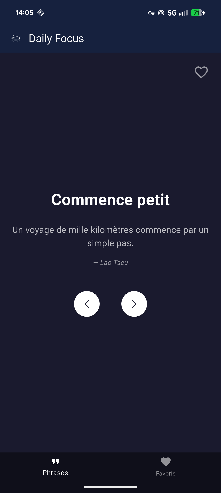
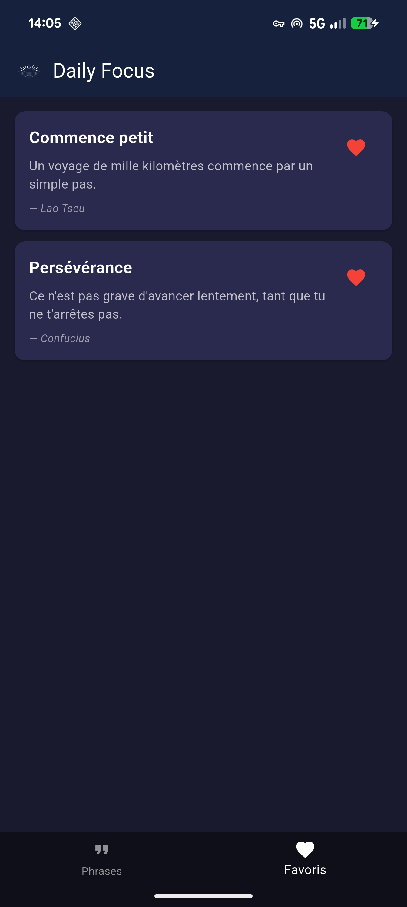

# Daily Focus - Documentation Pédagogique Flutter

## Introduction

Cette application a été créée pour apprendre Flutter par la pratique. Plutôt que de la théorie abstraite, on part d'une app fonctionnelle qu'on décortique pour comprendre.

**Daily Focus** affiche des phrases de motivation avec la possibilité de les sauvegarder en favoris.

---

## Aperçu de l'application

<p align="center">
  
  
</p>

---

## Prérequis

Avant de commencer, installe :
- Flutter SDK : https://flutter.dev/docs/get-started/install
- Android Studio (avec le plugin Flutter)
- Un émulateur Android ou un téléphone en mode développeur

Vérifie ton installation :
```bash
flutter --version
```

---

## Créer le projet

```bash
cd D:\ton\dossier
flutter create flutter_daily_focus
cd flutter_daily_focus
```

---

## Structure du projet

```
flutter_daily_focus/
├── lib/
│   ├── main.dart              # Point d'entrée
│   ├── data/
│   │   └── focus_data.dart    # Données (phrases)
│   ├── models/
│   │   └── focus_message.dart # Structure des données
│   └── screens/
│       ├── main_screen.dart      # Navigation
│       ├── home_screen.dart      # Écran d'accueil
│       └── favorites_screen.dart # Écran favoris
├── assets/
│   └── images/
│       └── logo.png           # Logo de l'app
├── pubspec.yaml               # Configuration
└── ...
```

### Pourquoi cette structure ?

| Dossier | Rôle |
|---------|------|
| `lib/` | Tout le code Dart de l'app |
| `models/` | Structure des données (c'est quoi un objet "phrase" ?) |
| `screens/` | Les écrans (ce que l'utilisateur voit) |
| `data/` | Les données (en dur ou depuis une API plus tard) |
| `assets/` | Images, fonts, fichiers statiques |

---

## Les fichiers expliqués

### 1. main.dart - Point d'entrée

```dart
import 'package:flutter/material.dart';
import 'screens/main_screen.dart';

void main() {
  runApp(const MyApp());
}

class MyApp extends StatelessWidget {
  const MyApp({super.key});

  @override
  Widget build(BuildContext context) {
    return MaterialApp(
      title: 'Daily Focus',
      debugShowCheckedModeBanner: false,
      theme: ThemeData(
        colorScheme: ColorScheme.fromSeed(seedColor: Colors.indigo),
        useMaterial3: true,
      ),
      home: const MainScreen(),
    );
  }
}
```

**Ce qu'il faut retenir :**
- `main()` → là où l'app démarre
- `runApp()` → lance le widget racine
- `MaterialApp` → configure l'app (thème, titre, écran d'accueil)

---

### 2. focus_message.dart - Le modèle

```dart
class FocusMessage {
  final String title;
  final String message;
  final String? author;

  const FocusMessage({
    required this.title,
    required this.message,
    this.author,
  });
}
```

**Ce qu'il faut retenir :**
- Une classe définit la structure d'un objet
- `final` → la valeur ne change plus après création
- `String?` → le "?" signifie que la valeur peut être vide (null)
- `required` → ce paramètre est obligatoire

---

### 3. focus_data.dart - Les données

```dart
import '../models/focus_message.dart';

const List<FocusMessage> focusMessages = [
  FocusMessage(
    title: "Commence petit",
    message: "Un voyage de mille kilomètres commence par un simple pas.",
    author: "Lao Tseu",
  ),
  // ... autres phrases
];
```

**Ce qu'il faut retenir :**
- Les données sont séparées du code d'affichage
- Plus tard, on pourra remplacer par un appel API sans toucher aux écrans

---

### 4. main_screen.dart - La navigation

```dart
import 'package:flutter/material.dart';
import '../models/focus_message.dart';
import 'home_screen.dart';
import 'favorites_screen.dart';

class MainScreen extends StatefulWidget {
  const MainScreen({super.key});

  @override
  State<MainScreen> createState() => _MainScreenState();
}

class _MainScreenState extends State<MainScreen> {
  int _selectedIndex = 0;
  final List<FocusMessage> _favorites = [];

  void _toggleFavorite(FocusMessage message) {
    setState(() {
      if (_favorites.contains(message)) {
        _favorites.remove(message);
      } else {
        _favorites.add(message);
      }
    });
  }

  bool _isFavorite(FocusMessage message) {
    return _favorites.contains(message);
  }

  @override
  Widget build(BuildContext context) {
    return Scaffold(
      appBar: AppBar(
        title: Row(
          children: [
            Image.asset(
              'assets/images/logo.png',
              height: 32,
            ),
            const SizedBox(width: 10),
            const Text('Daily Focus'),
          ],
        ),
        backgroundColor: const Color(0xFF16213E),
        foregroundColor: Colors.white,
        elevation: 0,
      ),
      body: IndexedStack(
        index: _selectedIndex,
        children: [
          HomeScreen(
            onToggleFavorite: _toggleFavorite,
            isFavorite: _isFavorite,
          ),
          FavoritesScreen(
            favorites: _favorites,
            onToggleFavorite: _toggleFavorite,
          ),
        ],
      ),
      bottomNavigationBar: BottomNavigationBar(
        currentIndex: _selectedIndex,
        onTap: (index) {
          setState(() {
            _selectedIndex = index;
          });
        },
        backgroundColor: const Color(0xFF0F0F1A),
        selectedItemColor: Colors.white,
        unselectedItemColor: Colors.white54,
        items: const [
          BottomNavigationBarItem(
            icon: Icon(Icons.format_quote),
            label: 'Phrases',
          ),
          BottomNavigationBarItem(
            icon: Icon(Icons.favorite),
            label: 'Favoris',
          ),
        ],
      ),
    );
  }
}
```

**Ce qu'il faut retenir :**
- `Scaffold` → structure de base d'un écran (AppBar, body, bottomNavigationBar)
- `IndexedStack` → garde tous les écrans en mémoire, affiche celui sélectionné
- `BottomNavigationBar` → barre de navigation en bas
- `setState()` → dit à Flutter de redessiner l'écran
- `Image.asset()` → affiche une image depuis le dossier assets

---

### 5. home_screen.dart - Écran d'accueil

```dart
import 'package:flutter/material.dart';
import '../models/focus_message.dart';
import '../data/focus_data.dart';

class HomeScreen extends StatefulWidget {
  final Function(FocusMessage) onToggleFavorite;
  final bool Function(FocusMessage) isFavorite;

  const HomeScreen({
    super.key,
    required this.onToggleFavorite,
    required this.isFavorite,
  });

  @override
  State<HomeScreen> createState() => _HomeScreenState();
}

class _HomeScreenState extends State<HomeScreen> {
  int _currentIndex = 0;

  void _nextMessage() {
    setState(() {
      _currentIndex = (_currentIndex + 1) % focusMessages.length;
    });
  }

  void _previousMessage() {
    setState(() {
      _currentIndex = (_currentIndex - 1 + focusMessages.length) % focusMessages.length;
    });
  }

  @override
  Widget build(BuildContext context) {
    final message = focusMessages[_currentIndex];
    final isFav = widget.isFavorite(message);

    return Container(
      color: const Color(0xFF1A1A2E),
      child: Stack(
        children: [
          Padding(
            padding: const EdgeInsets.symmetric(horizontal: 24.0),
            child: Column(
              mainAxisAlignment: MainAxisAlignment.center,
              children: [
                Text(
                  message.title,
                  style: const TextStyle(
                    fontSize: 32,
                    fontWeight: FontWeight.bold,
                    color: Colors.white,
                  ),
                ),
                const SizedBox(height: 24),
                Text(
                  message.message,
                  textAlign: TextAlign.center,
                  style: const TextStyle(
                    fontSize: 18,
                    color: Colors.white70,
                    height: 1.5,
                  ),
                ),
                if (message.author != null) ...[
                  const SizedBox(height: 16),
                  Text(
                    "— ${message.author}",
                    style: const TextStyle(
                      fontSize: 14,
                      fontStyle: FontStyle.italic,
                      color: Colors.white54,
                    ),
                  ),
                ],
                const SizedBox(height: 48),
                Row(
                  mainAxisAlignment: MainAxisAlignment.center,
                  children: [
                    ElevatedButton(
                      onPressed: _previousMessage,
                      style: ElevatedButton.styleFrom(
                        backgroundColor: Colors.white,
                        foregroundColor: const Color(0xFF1A1A2E),
                        padding: const EdgeInsets.all(16),
                        shape: const CircleBorder(),
                      ),
                      child: const Icon(Icons.arrow_back_ios_new, size: 20),
                    ),
                    const SizedBox(width: 32),
                    ElevatedButton(
                      onPressed: _nextMessage,
                      style: ElevatedButton.styleFrom(
                        backgroundColor: Colors.white,
                        foregroundColor: const Color(0xFF1A1A2E),
                        padding: const EdgeInsets.all(16),
                        shape: const CircleBorder(),
                      ),
                      child: const Icon(Icons.arrow_forward_ios, size: 20),
                    ),
                  ],
                ),
              ],
            ),
          ),
          Positioned(
            top: 16,
            right: 16,
            child: IconButton(
              onPressed: () => widget.onToggleFavorite(message),
              icon: Icon(
                isFav ? Icons.favorite : Icons.favorite_border,
                color: isFav ? Colors.red : Colors.white54,
                size: 32,
              ),
            ),
          ),
        ],
      ),
    );
  }
}
```

**Ce qu'il faut retenir :**
- `StatefulWidget` → l'écran change (index de la phrase)
- `Stack` → superpose des widgets (contenu + bouton favori par-dessus)
- `Positioned` → place un widget à un endroit précis dans le Stack
- `Column` → empile les éléments verticalement
- `Row` → aligne les éléments horizontalement

---

### 6. favorites_screen.dart - Écran favoris

```dart
import 'package:flutter/material.dart';
import '../models/focus_message.dart';

class FavoritesScreen extends StatelessWidget {
  final List<FocusMessage> favorites;
  final Function(FocusMessage) onToggleFavorite;

  const FavoritesScreen({
    super.key,
    required this.favorites,
    required this.onToggleFavorite,
  });

  @override
  Widget build(BuildContext context) {
    return Container(
      color: const Color(0xFF1A1A2E),
      child: favorites.isEmpty
          ? const Center(
              child: Text(
                'Aucun favori pour le moment',
                style: TextStyle(color: Colors.white54, fontSize: 16),
              ),
            )
          : ListView.builder(
              padding: const EdgeInsets.all(16),
              itemCount: favorites.length,
              itemBuilder: (context, index) {
                final message = favorites[index];
                return Card(
                  color: const Color(0xFF2A2A4E),
                  margin: const EdgeInsets.only(bottom: 12),
                  child: Padding(
                    padding: const EdgeInsets.all(16),
                    child: Row(
                      crossAxisAlignment: CrossAxisAlignment.start,
                      children: [
                        Expanded(
                          child: Column(
                            crossAxisAlignment: CrossAxisAlignment.start,
                            children: [
                              Text(
                                message.title,
                                style: const TextStyle(
                                  fontSize: 18,
                                  fontWeight: FontWeight.bold,
                                  color: Colors.white,
                                ),
                              ),
                              const SizedBox(height: 8),
                              Text(
                                message.message,
                                style: const TextStyle(
                                  fontSize: 14,
                                  color: Colors.white70,
                                ),
                              ),
                              if (message.author != null) ...[
                                const SizedBox(height: 8),
                                Text(
                                  "— ${message.author}",
                                  style: const TextStyle(
                                    fontSize: 12,
                                    fontStyle: FontStyle.italic,
                                    color: Colors.white54,
                                  ),
                                ),
                              ],
                            ],
                          ),
                        ),
                        IconButton(
                          onPressed: () => onToggleFavorite(message),
                          icon: const Icon(
                            Icons.favorite,
                            color: Colors.red,
                          ),
                        ),
                      ],
                    ),
                  ),
                );
              },
            ),
    );
  }
}
```

**Ce qu'il faut retenir :**
- `StatelessWidget` → l'écran ne gère pas d'état, il affiche juste ce qu'on lui donne
- `ListView.builder` → crée une liste scrollable, optimisée pour les grandes listes
- `Expanded` → prend tout l'espace disponible dans un Row/Column
- Condition ternaire `condition ? siVrai : siFaux`

---

## Ajouter des images (assets)

### 1. Créer le dossier
Le dossier `assets/images/` doit être **à la racine** du projet (à côté de `lib/`, pas dedans).

### 2. Déclarer dans pubspec.yaml
```yaml
flutter:
  uses-material-design: true

  assets:
    - assets/images/
```

### 3. Utiliser dans le code
```dart
Image.asset(
  'assets/images/logo.png',
  height: 32,
)
```

### 4. Après ajout d'une image
```bash
flutter clean
flutter pub get
flutter run
```

---

## Concepts clés Flutter

### StatelessWidget vs StatefulWidget

| | StatelessWidget | StatefulWidget |
|---|---|---|
| Données | Fixes | Peuvent changer |
| setState() | Non | Oui |
| Exemple | FavoritesScreen | HomeScreen |

**Règle simple :** Si l'écran doit changer après sa création → StatefulWidget. Sinon → StatelessWidget.

### Les widgets de base

| Widget | Rôle |
|--------|------|
| `Container` | Boîte avec couleur, padding, taille |
| `Column` | Empile verticalement |
| `Row` | Aligne horizontalement |
| `Stack` | Superpose des widgets |
| `Padding` | Ajoute de l'espace autour |
| `Center` | Centre son contenu |
| `Expanded` | Prend l'espace disponible |
| `SizedBox` | Espace vide de taille fixe |
| `ListView` | Liste scrollable |

### Passer des données entre widgets

On passe des fonctions en paramètre :

```dart
// Parent
HomeScreen(
  onToggleFavorite: _toggleFavorite,  // On passe la fonction
)

// Enfant
widget.onToggleFavorite(message);  // On appelle la fonction du parent
```

---

## Lancer l'application

```bash
flutter run
```

Ou dans Android Studio : bouton Play vert.

---

## Pour aller plus loin

- Sauvegarder les favoris avec `shared_preferences`
- Récupérer les phrases depuis une API
- Ajouter des notifications quotidiennes
- Créer un widget pour le home screen

---

## Ressources

- Documentation Flutter : https://docs.flutter.dev
- Widgets catalog : https://docs.flutter.dev/ui/widgets
- Pub.dev (packages) : https://pub.dev

---

*Créé par Maixent Dassoah pour apprendre Flutter.*